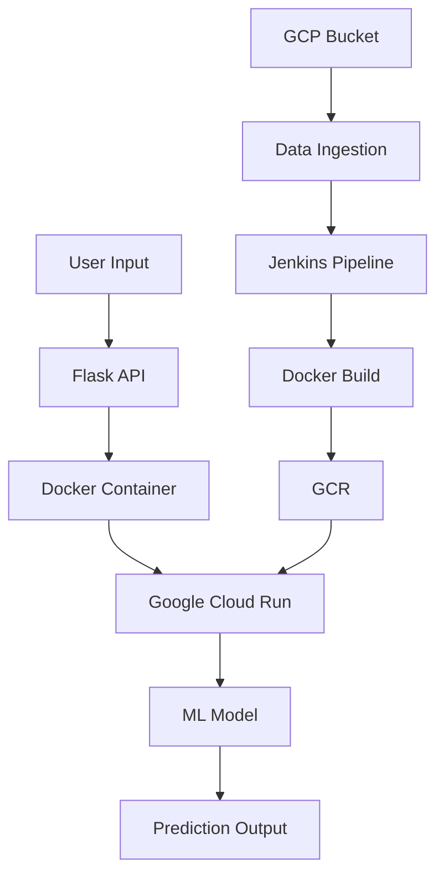
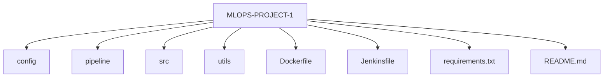

<h1 align="center">🏨 Hotel Reservation Cancellation Prediction</h1>

<p align="center">
<b>End-to-End Production MLOps Pipeline using GCP, Docker & Jenkins</b>
</p>

<p align="center">
  
  
  
  
  
  
</p>

---

# 📌 Project Overview

This project predicts whether a hotel customer will cancel their reservation based on booking details.

The goal of this project is not just Machine Learning —  
but building a **complete production-level MLOps pipeline**.

Users provide booking details → Model predicts → System deployed on Google Cloud.

---

# 🧠 Problem Statement

Hotels lose significant revenue due to booking cancellations.

We built a classification system that predicts:

> **Will the customer cancel the reservation?**
>
> - `0` → Not Cancelled  
> - `1` → Cancelled  

---

# 📥 Model Input Features

| Feature | Description |
|----------|-------------|
| lead_time | Days between booking and arrival |
| no_of_special_requests | Number of special requests |
| avg_price_per_room | Average room price |
| arrival_month | Month of arrival |
| arrival_date | Date of arrival |
| market_segment_type | Market segment type |
| no_of_week_nights | Weekday nights stayed |
| no_of_weekend_nights | Weekend nights stayed |
| room_type_reserved | Reserved room type |
| type_of_meal_plan | Selected meal plan |

---

# 🏗️ Complete MLOps Architecture



---
## flowchart LR
    A[Developer Push Code] --> B[GitHub]
    B --> C[Jenkins Trigger]
    C --> D[Create Virtual Environment]
    D --> E[Install Dependencies]
    E --> F[Train Model + MLflow]
    F --> G[Build Docker Image]
    G --> H[Push to GCR]
    H --> I[Deploy to Cloud Run]
    I --> J[Public Endpoint]

## 🔁 CI/CD Stages Breakdown
### 1️⃣ Jenkins Setup

Jenkins runs inside Docker (DinD)

GitHub integrated via credentials

GCP Service Account authentication configured

### 2️⃣ GitHub Integration

Pipeline auto-triggers on code push

Jenkinsfile defines full CI/CD steps

Secure SCM checkout

### 3️⃣ Virtual Environment Setup
python -m venv venv
source venv/bin/activate
pip install -e .

Ensures:

Dependency isolation

Clean builds

Reproducibility

### 4️⃣ Model Training & Experiment Tracking

#### Algorithm: LightGBM

#### Hyperparameter tuning: RandomizedSearchCV

#### Experiment tracking: MLflow

### Metrics Logged:

* Accuracy

* Precision

* Recall

* F1 Score

mlflow.set_tracking_uri("file:./mlruns")
mlflow.set_experiment("mlops-project")
### 5️⃣ Dockerization
#### FROM python:slim
#### WORKDIR /app
#### COPY . .
#### RUN pip install --no-cache-dir -e .
#### RUN python -m pipeline.training_pipeline

### Purpose:

* Containerized training

* Portable deployment

* Reproducible environment

### 6️⃣ Push Image to Google Container Registry (GCR)
#### gcloud auth activate-service-account --key-file=$GOOGLE_APPLICATION_CREDENTIALS
#### gcloud config set project $GCP_PROJECT
#### gcloud auth configure-docker

docker build -t gcr.io/$GCP_PROJECT/ml-project:latest .
docker push gcr.io/$GCP_PROJECT/ml-project:latest
### 7️⃣ Deploy to Google Cloud Run
* gcloud run deploy ml-project \
####  --image gcr.io/$GCP_PROJECT/ml-project:latest \
####  --platform managed \
####  --region asia-south1 \
####  --allow-unauthenticated

### Features:

* Serverless

* Auto-scaling

* Secure

* Public HTTPS endpoint

### ☁️ Cloud Services Used
* Service	Purpose
* GCP Bucket	Data Ingestion
* Jenkins	CI/CD Automation
* Docker	Containerization
* GCR	Docker Image Storage
* Cloud Run	Deployment
* MLflow	Experiment Tracking

## 📂 Project Structure



🚀 Fully Automated Flow
🎯 What This Project Demonstrates

✔ End-to-End MLOps Pipeline
✔ CI/CD Automation
✔ Model Lifecycle Management
✔ Cloud-Native Deployment
✔ Dockerized ML Workflow
✔ Experiment Tracking with MLflow
✔ Production-Grade Infrastructure

👨‍💻 Author

Jayant Yadav
B.Tech 
MLOps | Machine Learning | Cloud

<p > ⭐ If you like this project, consider giving it a star! </p> ```

